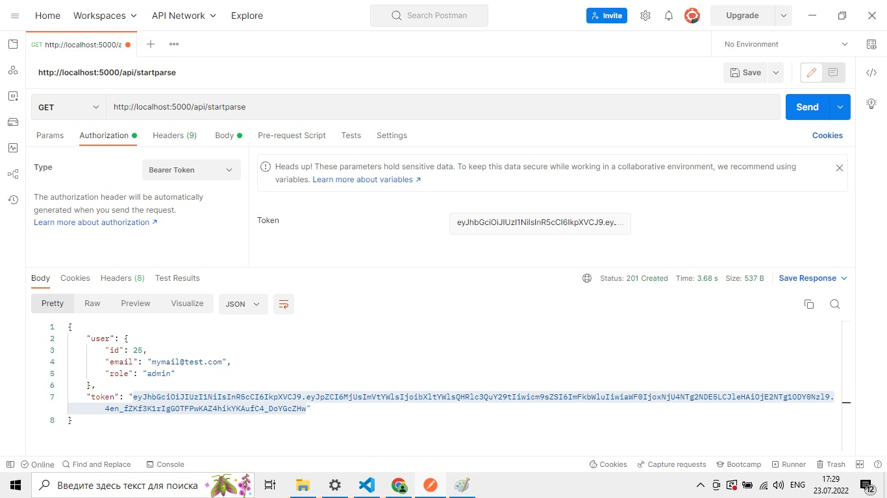

# Парсер биржи криптовалют

Используемые фреймворки и библиотеки:

- [NestJS]
- [Puppeteer]
- [socket.io]
- [Sequelize]
- [PostreSQl + sequelize]

## Установка

1. Скопировать файлы в папку с программой. На компьютере обязательно должна быть установлена Node.js + NestJs и база данных PostgreSQL!!!!!
2. Открыть терминал ОС в папке с файлами и запустить команду: npm install
3. Перейти в файл .env и настроить:

- DELAY_PARSING - интервал через который будет происходить парсинг биржи криптовалют
- POSTGRES_USER - имя пользователя базы данных postgresql
- POSTGRES_PASSWORD - пароль от базы данных
- POSTGRES_PORT - порт
- POSTGRES_DB - имя базы данных

5. После установки набрать команду npm run start, сервер должен запуститься на http://localhost:5000/

## Использование

1. Данные отдаются сервером в формате JSON (строка)
2. На сайте реализована регистрация и авторизация

- http://localhost:5000/auth/registration
- http://localhost:5000/auth/login

Роль для пользователя добавляется в момент регистрации, вот пример данных для регистрации при использовании Postman:
{
"email":"mymail@test.com",
"password":"12345",
"role":"admin"  
}

В ответ получаете сформированный JWT token

Старт парсинга (доступно для пользователей только с ролью 'admin'):

- http://localhost:5000/api/startparse (если работаете через Postman цепляете полученный ранее JWT Token)

Остановка парсинга (доступно для пользователей только с ролью 'admin'):

- http://localhost:5000/api/stopparse (если работаете через Postman цепляете полученный ранее JWT Token)

Для наглядности получения данных сервер раздает статику, можно открыть браузер и перейти по ссылке:

- http://localhost:5000

В форму ввести в input любое значение и нажать кнопку "Получить данные"
